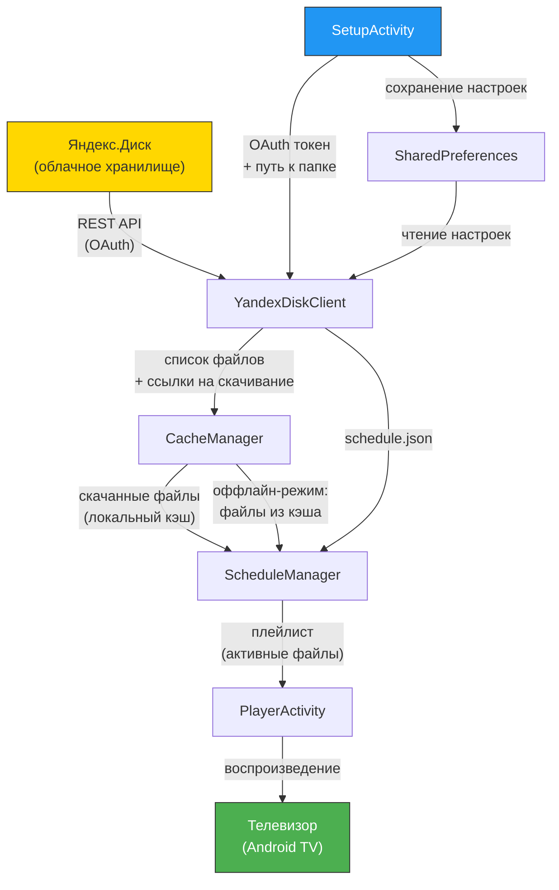

# Teliki Signage — Архитектура v2

## Обзор

**Teliki Signage** — Android TV приложение для цифровой вывески (digital signage) в кофейнях. Приложение загружает медиаконтент (изображения, видео) с Яндекс.Диска и воспроизводит его по расписанию на телевизорах в торговых точках.

---

## Бэкенд: Яндекс.Диск

В качестве бэкенда используется **Яндекс.Диск** через публичный REST API. Авторизация — по OAuth-токену, который выдаётся при первой настройке приложения.

### Используемые API-эндпоинты

| Метод | URL | Назначение |
|-------|-----|------------|
| `GET` | `https://cloud-api.yandex.net/v1/disk/resources?path=...` | Получить список файлов и папок по указанному пути |
| `GET` | `https://cloud-api.yandex.net/v1/disk/resources/download?path=...` | Получить прямую ссылку на скачивание файла |

**Заголовки запросов:**

```
Authorization: OAuth <TOKEN>
Accept: application/json
```

### Пример запроса списка файлов

```http
GET https://cloud-api.yandex.net/v1/disk/resources?path=/Teliki/Кофемания/Экран 1&limit=100
Authorization: OAuth y0_AgAAAA...
```

### Пример ответа

```json
{
  "_embedded": {
    "items": [
      {
        "name": "promo_summer.mp4",
        "type": "file",
        "path": "disk:/Teliki/Кофемания/Экран 1/promo_summer.mp4",
        "size": 15728640,
        "modified": "2026-06-10T12:00:00+00:00"
      },
      {
        "name": "schedule.json",
        "type": "file",
        "path": "disk:/Teliki/Кофемания/Экран 1/schedule.json",
        "size": 512,
        "modified": "2026-06-10T12:05:00+00:00"
      }
    ]
  }
}
```

---

## Структура папок на Яндекс.Диске

```
Teliki/
├── Кофемания/
│   ├── Экран 1/
│   │   ├── promo_summer.mp4
│   │   ├── menu_board.jpg
│   │   └── schedule.json
│   └── Экран 2/
│       ├── loyalty_card.mp4
│       └── schedule.json
├── Бариста/
│   └── Экран 1/
│       ├── welcome.mp4
│       └── schedule.json
└── ...
```

**Правила именования:**
- `Teliki/` — корневая папка проекта
- `{CoffeeName}/` — название кофейни (произвольное)
- `{Экран N}/` — номер экрана в кофейне
- Внутри папки экрана лежат медиафайлы и файл расписания `schedule.json`

---

## Формат расписания (schedule.json)

Файл `schedule.json` определяет, какие файлы показывать и в какое время:

```json
{
  "items": [
    {
      "file": "promo_summer.mp4",
      "start": "08:00",
      "end": "12:00"
    },
    {
      "file": "menu_board.jpg",
      "start": "12:00",
      "end": "18:00"
    },
    {
      "file": "promo_evening.mp4",
      "start": "18:00",
      "end": "23:00"
    }
  ]
}
```

| Поле | Тип | Описание |
|------|-----|----------|
| `file` | `string` | Имя файла в той же папке на Яндекс.Диске |
| `start` | `string` | Время начала показа в формате `HH:mm` |
| `end` | `string` | Время окончания показа в формате `HH:mm` |

**Логика:**
- Если текущее время попадает в интервал `[start, end)` — файл воспроизводится.
- Если несколько элементов перекрываются по времени — воспроизводятся по очереди (плейлист).
- Если ни один элемент не активен — показывается заставка по умолчанию.
- Если `schedule.json` отсутствует — все файлы из папки воспроизводятся в алфавитном порядке 24/7.

---

## Модули Android-приложения

### YandexDiskClient

Сетевой клиент для работы с API Яндекс.Диска. Использует OkHttp + Retrofit.

**Ответственность:**
- Авторизация по OAuth-токену
- Получение списка файлов в папке
- Получение прямой ссылки на скачивание
- Обработка ошибок API (429, 503 и т.д.)

### CacheManager

Управление локальным кэшем медиафайлов.

**Ответственность:**
- Скачивание файлов по прямым ссылкам
- Хранение файлов во внутреннем хранилище приложения
- Проверка актуальности кэша (по дате модификации)
- Очистка устаревших файлов
- Предоставление локальных путей к файлам для плеера

### ScheduleManager

Парсинг и выполнение расписания.

**Ответственность:**
- Загрузка и парсинг `schedule.json`
- Определение текущего активного контента по времени
- Формирование плейлиста для PlayerActivity
- Периодическая проверка обновлений расписания

### PlayerActivity

Основной экран воспроизведения контента.

**Ответственность:**
- Полноэкранное воспроизведение видео (ExoPlayer) и изображений
- Автоматическое переключение между элементами плейлиста
- Зацикленное воспроизведение
- Обработка ошибок воспроизведения (пропуск битых файлов)

### SetupActivity

Экран первоначальной настройки приложения.

**Ответственность:**
- Ввод OAuth-токена Яндекс.Диска
- Выбор кофейни и экрана из списка папок
- Сохранение настроек в SharedPreferences
- Тестовое подключение к API

---

## Диаграмма потока данных



---

## Оффлайн-режим

Приложение поддерживает работу без интернета:

1. **При первом запуске** — интернет обязателен для загрузки контента.
2. **При последующих запусках:**
   - Приложение пытается обновить список файлов и расписание через API.
   - Если API недоступен (нет интернета, ошибка сервера) — используются закэшированные файлы и последнее сохранённое расписание.
   - Воспроизведение продолжается из локального кэша.
3. **Обновление кэша** происходит в фоне каждые 15 минут (настраивается).
4. **Индикация:** на экране не отображается статус подключения, чтобы не отвлекать посетителей кофейни.

---

## Требования к системе

| Параметр | Значение |
|----------|----------|
| ОС | Android TV (API 28+, Android 9.0+) |
| Оперативная память | ≥ 1 ГБ |
| Свободное место | ≥ 500 МБ для кэша |
| Интернет | Wi-Fi (для первоначальной загрузки и обновлений) |
| Кодеки видео | H.264 Baseline Profile |
| Разрешение видео | до 1920×1080 (Full HD) |
